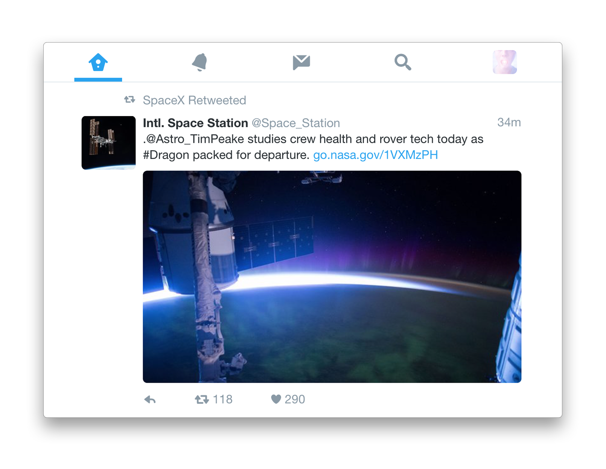

#  Refined Twitter

> An extension that makes Chrome always use the [mobile web](https://mobile.twitter.com) version of Twitter, which is much faster and better looking than the old [desktop web](https://twitter.com) version. When you open a link that would normally be to desktop Twitter, this extension redirects you to the mobile web version and makes it wider.

I'm happy to receive feature requests. See [refined-github](https://github.com/sindresorhus/refined-github#highlights) for inspiration of the possibilities. Can be new features, interface tweaks, more keyboard shortcuts, etc. Pull requests preferable.

**Check out [Anatine ](https://github.com/sindresorhus/anatine) — Desktop app version of this**

## Install

Install it from the [Chrome Web Store](https://chrome.google.com/webstore/detail/refined-twitter/nlfgmdembofgodcemomfeimamihoknip) or [manually](http://superuser.com/a/247654/6877).

Works on Firefox too, but requires [some manual steps for now](https://github.com/sindresorhus/refined-twitter/pull/3#issuecomment-217343256).

## Keyboard shortcuts

- New tweet/DM: <kbd>n</kbd>
- Send tweet/DM: <kbd>Cmd</kbd> <kbd>Enter</kbd> or <kbd>Ctrl</kbd> <kbd>Enter</kbd>
- Toggle dark mode: <kbd>d</kbd>
- Go to Home: <kbd>g</kbd> <kbd>h</kbd>
- Go to Notifications: <kbd>g</kbd> <kbd>n</kbd>
- Go to Messages: <kbd>g</kbd> <kbd>m</kbd>
- Go to Search: <kbd>/</kbd>
- Go to Profile: <kbd>g</kbd> <kbd>p</kbd>
- Go to Likes: <kbd>g</kbd> <kbd>l</kbd>
- Go to Lists: <kbd>g</kbd> <kbd>i</kbd>
- Go to next tweet: <kbd>j</kbd>
- Go to previous tweet: <kbd>k</kbd>
- Page down: <kbd>Ctrl</kbd> <kbd>d</kbd>
- Page up: <kbd>Ctrl</kbd> <kbd>u</kbd>
- Scroll to top: <kbd>g</kbd> <kbd>g</kbd>
- Scroll to bottom: <kbd>G</kbd>

## Related

- [Anatine](https://github.com/sindresorhus/anatine) - Pristine Twitter app
- [Refined GitHub](https://github.com/sindresorhus/refined-github) - Like this, but for GitHub
- [Refined Wikipedia](https://github.com/ismamz/refined-wikipedia) - Like this, but for Wikipedia

## Created by

- [Sindre Sorhus](https://gitter.im/sindresorhus)
- [Paul Molluzzo](https://github.com/paulmolluzzo)
- [Contributors…](https://github.com/sindresorhus/refined-twitter/graphs/contributors)

## License

MIT © [Sindre Sorhus](https://sindresorhus.com)
